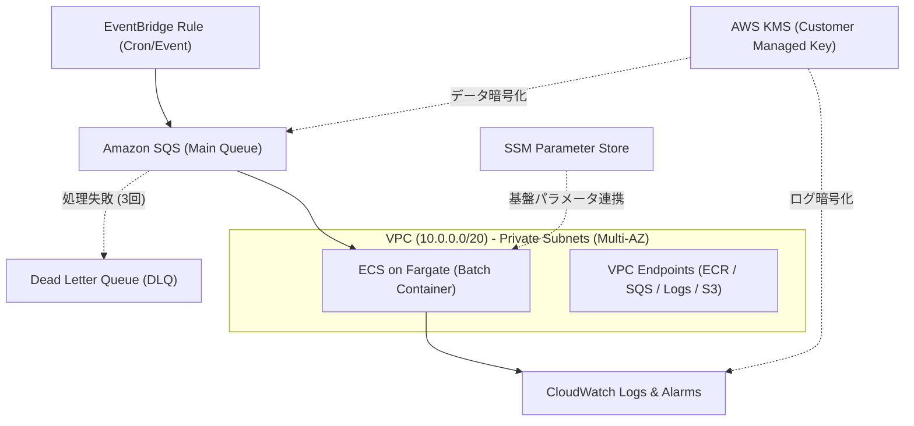

# Event-Driven Batch Pipeline (Terraform × AWS CDK)

外部システム連携や定期スケジュールを起点に、堅牢かつセキュアに起動・スケールする**イベント駆動型サーバーレスバッチ処理基盤**のリポジトリです。

本プロジェクトでは**「Terraform × AWS CDK 二刀流戦略」**を採用し、堅牢な基盤・ステートフル層と柔軟なアプリケーション・ステートレス層の責務を美しく分離しています。

---

## 🌟 インフラの特長 & ハイライト

1. **Terraform × AWS CDK 二刀流アーキテクチャ**
   - **Terraform**: VPC、Subnet、KMS、ECR、SQSなどの基盤リソースを宣言的かつ厳格に管理。
   - **AWS CDK**: EventBridge ルール、ECS Task 定義、CloudWatch Alarm などのアプリ結合層を TypeScript で型安全にプログラミング。
   - **疎結合な連携**: Terraform の出力値は AWS Systems Manager Parameter Store を介して CDK へ安全に引き渡されます。

2. **完全プライベート & ゼロ常時稼働コスト**
   - コンテナはパブリックIPを持たず、マルチAZのプライベートサブネット内で安全に完結。
   - NAT Gateway を排除し、AWS PrivateLink (VPC Endpoints) を活用することで通信コストと固定費を大幅削減。
   - ECS on Fargate のオンデマンド/スポットハイブリッド運用により、ジョブ完了後は完全な Scale-to-Zero を実現。

3. **エンタープライズ基準の堅牢性とオブザーバビリティ**
   - SQS デッドレターキュー（DLQ）によるメッセージ欠損防止と再送保護。
   - AWS KMS (CMK) によるキューデータおよびログの完全暗号化。
   - CloudWatch Alarm による DLQ 滞留検知およびタスク異常終了のリアルタイム検知。

---

## 🏗 システムアーキテクチャ (Mermaid)



---

## 📁 ディレクトリ構成

```text
├── terraform/                # [Terraform] コアインフラ基盤層
│   ├── environments/
│   │   └── prd/
│   │       ├── main.tf
│   │       ├── variables.tf
│   │       └── terraform.tfvars
│   └── modules/
│       ├── network/          # VPC, Subnets, VPC Endpoints
│       ├── security/         # KMS, Security Groups, IAM Base
│       └── queue/            # SQS, DLQ, SSM Parameters
│
├── cdk/                      # [AWS CDK] アプリケーション連携・タスク層
│   ├── bin/
│   │   └── app.ts
│   ├── lib/
│   │   ├── config.ts         # SSMから基盤識別子を取得するロジック
│   │   ├── ecs-task-stack.ts # ECSタスク定義・IAM Role
│   │   └── trigger-stack.ts  # EventBridge Rule・CloudWatch Alarms
│   ├── cdk.json
│   └── package.json
│
└── src/                      # バッチアプリケーションソースコード
    ├── Dockerfile
    └── index.py
```

---

## 🚀 デプロイ手順

### Step 1: Terraform で基盤リソースをプロビジョニング
```bash
cd terraform/environments/prd
terraform init
terraform plan
terraform apply
```
*※ VPC ID、Queue ARN、KMS Key ARN 等が SSM Parameter Store に自動登録されます。*

### Step 2: バッチコンテナイメージのビルド & Push
```bash
# ECR ログイン
aws ecr get-login-password --region ap-northeast-1 | docker login --username AWS --password-stdin <ACCOUNT_ID>.dkr.ecr.ap-northeast-1.amazonaws.com

# イメージビルド & プッシュ
cd ../../../src
docker build -t batch-app .
docker tag batch-app:latest <ACCOUNT_ID>.dkr.ecr.ap-northeast-1.amazonaws.com/batch-app:latest
docker push <ACCOUNT_ID>.dkr.ecr.ap-northeast-1.amazonaws.com/batch-app:latest
```

### Step 3: AWS CDK でアプリケーション・トリガー層をデプロイ
```bash
cd ../cdk
npm install
npx cdk diff
npx cdk deploy --all
```

---

## 🎭 キャスト & クレジット

本プロジェクトは、AIアプリ工場劇場の精鋭エージェントチームによって設計・構築・品質検証されました。

- **agent🔵（企画・要件定義）**: ユーザーニーズを掘り下げ、疎結合かつ耐障害性に優れたイベント駆動バッチの要件を策定。
- **agent🍇（アーキテクチャ設計）**: Terraform × AWS CDK の二刀流境界設計と、SSMを介したエレガントな連携パターンを設計。
- **agent🍊（IaC実装・ビルド）**: 堅牢なモジュール分割とベストプラクティスに基づき、Terraform & CDK コードを爆速構築。
- **agent🟢（品質保証・レビュー）**: セキュリティポリシー、暗号化基準、最小権限の原則（Least Privilege）を徹底検証。
- **agent🟡（プロジェクトプロデュース）**: リポジトリ統合、アーキテクチャの可視化、そして本ドキュメントの最終監修。